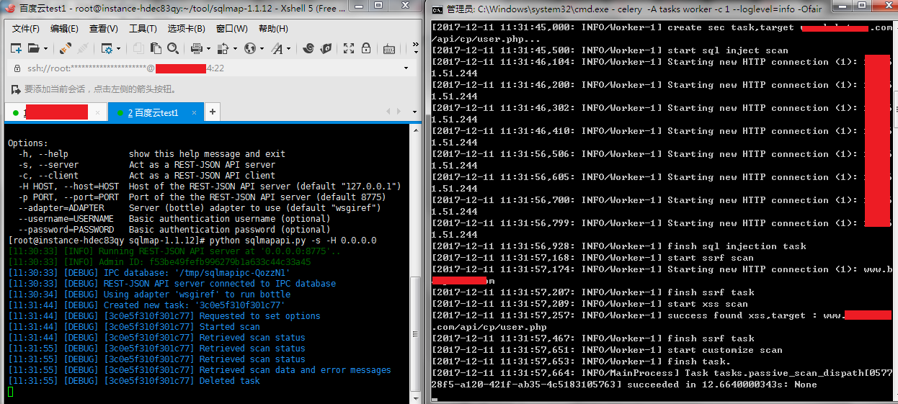

# PassiveSecCheck 0.1

自动化被动扫描系统共分为数据源、数据处理、任务分发、漏洞验证四个字系统，本系统属于任务发布、漏洞验证部分，读取数据源信息，进行分布式安全验证，确定是否包含相关严重漏洞。

## Author ##

咚咚呛 

如有其他建议，可联系微信280495355

## Support ##

满足如下安全需求

	1、对提供的http协议的五个元素进行安全测试(协议、方法、host、接口、参数)
	2、可提供host和session对照表，用于登录后测试
	3、提供自定义规则扫描，用于测试越权漏洞和常见漏洞等

技术细节如下：

	1、接受数据源为json格式,以含五元素为主
	2、分布式采用Celery + Redis结构
	3、提供SQL注入、SSRF、XSS等检测,
	4、SSRF的检测，原理是把相关参数替换为指定的链接信息，然后读取此web日志，确定漏洞
	5、SQL注入使用sqlmapapi的接口验证漏洞
	6、提供参数替换接口、防止参数中出现session等值
	7、提供host和session对照接口，可事实进行测试替换
	8、提供白名单接口，可无条件放过测试
	9、提供自定义规则接口，进行自定义漏洞检测，主要用于越权和常见漏洞检测
	10、扫描结果以KV数据存储到Redis中
	11、各个模块的配置信息和规则均存储在redis中，可实时修改。

## Test Environment ##

>Windows 7 旗舰版 / centos 7
>
>python 2.7.5

## Tree ##

	PublicSecScan
	----lib                #模块库文件
	----log                #日志目录
	----tasks.py   		   #分布式调度任务
	----run.py   		   #任务分发主程序，用于测试
	----nginxlog.py		   #SSRF漏洞验证，用于读取nginx访问日志

## Deploy ##
	
	部署分为三块，一个任务分发、一个扫描任务执行Worker、一个是ssrf漏洞验证Worker
	因为各个模块用的配置为一个配置文件，故建议先性配置完毕./lib/config.py后，在部署各个模块。

	1、任意机子安装redis，用于分布式漏洞验证消息队列
	$ yum install redis
	$ vim /etc/redis.conf
	# 更改bind 127.0.0.1 改成了 bind 0.0.0.0
	# 添加一行requirepass xxxxx密码
	# 修改daemonize yes
	$ redis-server /etc/redis.conf
	
	2、任务发布
	$ pip install -r requirements.txt
	# 配置./lib/config.py 文件，填入数据源redis信息和漏洞验证消息队列redis
	# 配置定时任务cron.d，按照自身的要求，定时扫一遍所有接口的安全隐患
	$ python run.py 可手动任务发布一次
	
	2、Worker部署(建议以centos为主)
	1） pip install -r requirements.txt
	2） 下载sqlmap，并执行 nohup python sqlmapapi.py -s &
	2） 配置./lib/config.py 文件，填入Redis和其他等相关信息
	3） cmd代码目录执行，-c 1代表多一个worker进程，可增加，执行如下：
		celery -A tasks worker -c 1 --loglevel=info -Ofair
	
	3、找一台机子部署ssrf验证worker
	1） yum install nginx
	2） 配置/etc/nginx 文件，修改如下：log_format  main '$request';
	3） 启动nginx
	4） 配置./lib/config.py 文件，填入Redis和其他等相关信息
	5） 写文件cron.d定时执行python nginxlog.py

## Config ##

配置目录：./lib/config.py

	# 此处为数据源存储的redis信息
	DATA_REDIS_HOST = '127.0.0.1'
	DATA_REDIS_PORT = 6379
	DATA_REDIS_PASSWORD = '122112121212'
	DATA_REDIS_DB = 5
	
	# 此处为分布式漏洞验证消息队列redis
	REDIS_HOST = '182.61.11.11'
	REDIS_PORT = 6379
	REDIS_PASSWORD = '11112222'
	REDIS_DB = 5
	
	# ------------------------------------------------------------------
	# ------任务发布 可不需要配置下列信息----------------------------------
	# ------------------------------------------------------------------
	
	# 配置参数中的替换字符，防止参数中出现session权限判断等,在get或post方法中出现如下参数名称则替换为响应的参数值
	conf_parameter_json = {
	    'session': '12234234234'
	}
	# 维持一个sesson访问列表
	conf_cookies = [
	    {'domain': '*.test.com', 'cookie': 'aaaaa=bbbbb'},
	    {'domain': 'www.test.com', 'cookie': 'session=aaaa'},
	    {'domain': 'aaa.testbbb.com', 'cookie': 'NL=1234'}
	]
	# 白名单路径，路径中出现如/admin不进行任何安全检测
	conf_white_path = ['/admin', '/administra']
	# 自定义漏洞匹配规则,遍历每个参数名称，当设定parameter时，值替换为设定的value字串，并在response中匹配正则rule
	# 不设定parameter时，代表挨个替换
	# 可以测试一些越权操作和一些常见漏洞
	# 比如设定参数名为phone，替换其参数值为手机号，并匹配response的body内，是否出现此人的个人信息。
	conf_scan_rule = [
	    {'value': '17600296111', 'rule': '111111111', 'name': 'Exceed Permissions', 'parameter': 'phone'},
	    {'value': '17600296112', 'rule': '22222222', 'name': 'Exceed Permissions', 'parameter': 'iphone'}
	]
	# server sqlmap远程ip链接
	sqlmap_server = 'http://127.0.0.1:8775/'
	# SQL检测最大运行时间(S)
	sqlmap_max_time = 600
	# db_type数据库检测类型
	sqlmap_db_type = ''
	# sqlmap扫描等级和风险
	sqlmap_level = 1
	sqlmap_risk = 1
	# ssrf_server远程ip或domain
	# ssrf实质是服务端访问了客户端传递的地址
	# 预先搭建一台web，收集分析日志可以判断ssrf触发点。
	ssrf_server = '10.1.1.3'
	# ssrf web日志路径
	ssrf_logpath = '/usr/local/openresty/nginx/logs/access.log'

## Worker Screenshot ##

